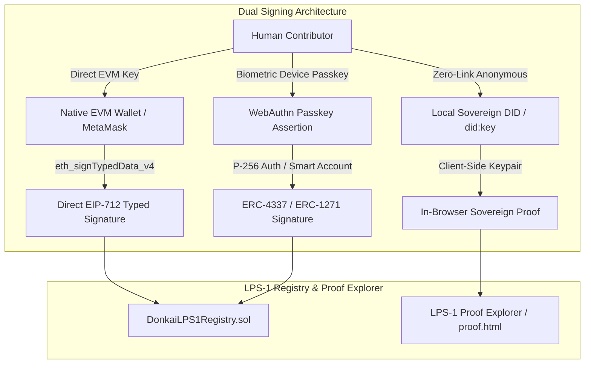

# DONK AI: Controlled Pilot Operations Manual & Boundary Playbook

**Document Identifier:** `DONKAI-PILOT-OPS-v1.0`  
**Target Milestone:** Controlled Non-Sensitive Pilot Phase  
**Governing Standard:** Living Provenance Standard 1 (LPS-1 v2.0)

---

## 1. Pilot Scope & Cohort Selection

To ensure rigorous protocol validation without exposing sensitive, personal, or legal testimony to unreviewed risks, the initial pilot operates strictly on **authorized, non-sensitive cultural cohorts**:

| Pilot Cohort | Domain | Test Objective |
| :--- | :--- | :--- |
| **1978 Arcade Memory Cohort** | Cultural pop technology (audio chimes, token rituals) | Blind independent corroboration, unprimed recall, and EIP-712 signing comprehension. |
| **Museum Exhibit Partner Cohort** | Public-domain archival photography (1977 cinema, marquee, tokyo synth) | Epistemic separation between source evidence vs synthetic visualization. |
| **Multilingual Recall Pilot** | Japanese and Arabic cultural broadcast memories | Unicode NFC canonicalization, derivative translation attestations. |
| **Decentralized Curator Circle** | Farcaster/Base Web3 historians | Non-transferable reviewer attestations, proof explorer verification. |

---

## 2. Cryptographic & Dual-Path Identity Architecture

### Identity Clarifications
- **EVM Wallet:** Signs structured `CreateRemembrance` payloads directly under the `DONK AI Human Remembrance Protocol` domain.
- **Passkey / WebAuthn:** Authenticates user intent via biometric hardware (Face ID / Touch ID), authorizing a smart account or session validator.
- **LPS-1 Manifest:** Portable JSON container storing statement roots, access policy hashes, and signatures.

---

## 3. Privacy, Consent & Key Lifecycle Rules

1. **Client-Side Encryption First:** Plaintext narrative is encrypted in the browser with `AES-GCM-256` using a fresh 96-bit random IV and Authenticated Associated Data (AAD) before off-chain upload.
2. **Zero Plaintext in Calldata:** The on-chain registry receives only fixed-size `bytes32` roots, timestamps, and monotonic nonces.
3. **Honest Access Status Transitions (Withdrawal):** Revocation is modeled as an on-chain status transition (`isWithdrawn = true`) and key unwrapping destruction—never as an impossible promise of universal erasure across third-party decentralized caches.
4. **Key Loss Policy:** Contributors receive clear notices that private vault records cannot be decrypted if their sovereign passphrase is lost.

---

## 4. Federated Social Adapter Boundaries

- Social platforms (TikTok, Instagram, YouTube, Farcaster, Bluesky) serve as **distribution derivatives** and **unprimed intake channels**.
- All generated share cards feature human-readable notices: *"Invites independent recollection. Does not establish historical truth."*
- Blind corroboration links suppress all author names, answer options, and existing split percentages prior to witness commitment.

---

## 5. Security & Deployment Hygiene Notice

> **Deployment Credential Status:**  
> All deployment credentials remain strictly isolated outside git repositories, CLI arguments, and transcripts. Secret scanning is active across all CI workflows.
