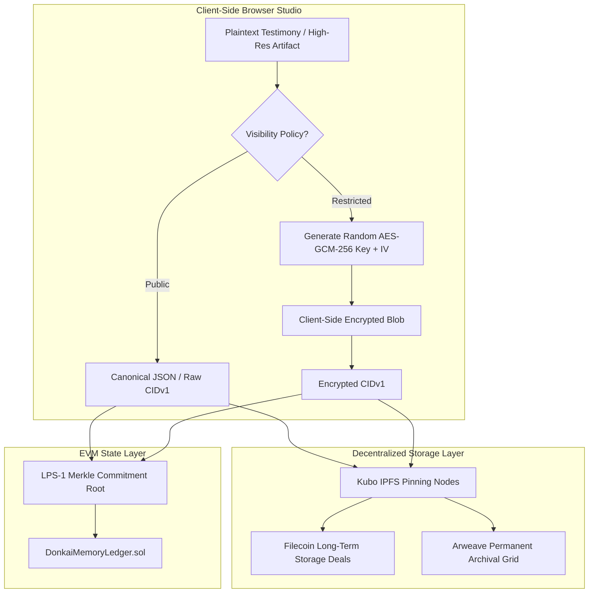

# DONK AI: Decentralized Storage & Payload Routing Architecture

**Document Identifier:** `STORAGE-ARCH-v1.0`  
**Status:** In Development  
**Scope:** Multi-Tiered Content Addressed Storage, Client-Side Encryption Routing, IPFS CIDv1, and Permanent Archival Deals.

---

## 1. Storage Tiering Topology

---

## 2. Key Distribution & Epoch Management

For `reviewer-only` and `trusted-circle` visibility modes, symmetric AES keys are encrypted under authorized public keys using ECIES (Elliptic Curve Integrated Encryption Scheme) or WebAuthn public key sets.

When access is revoked or an author amends their consent manifest:
1. A new **Key Epoch** is initiated.
2. Unrevoked recipients receive re-wrapped keys.
3. The previous epoch is tombstoned on `DonkaiPrivacyRegistry.sol`.
