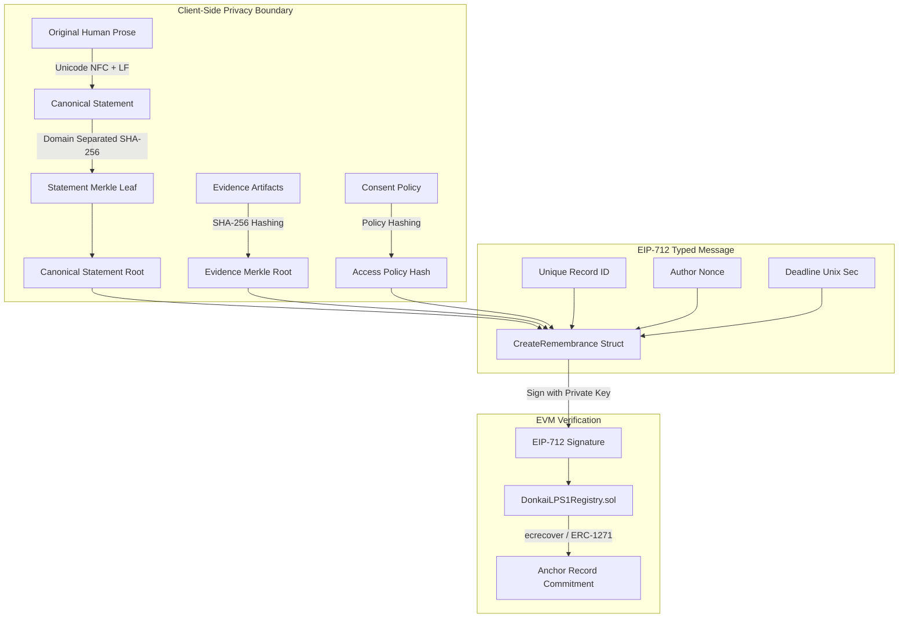

# DONK AI: EIP-712 Typed Commitment & Anti-Replay Specification (LPS-1 v2.0)

**Document Identifier:** `EIP712-LPS1-SPEC-v1.0`  
**Status:** Shipped Specification  
**Reference Solidity Contract:** [`contracts/src/DonkaiLPS1Registry.sol`](file:///C:/Users/Kevan/.gemini/antigravity-ide/scratch/Donkai---1977/contracts/src/DonkaiLPS1Registry.sol)  
**Standard References:** [EIP-712](https://eips.ethereum.org/EIPS/eip-712), [ERC-5267](https://eips.ethereum.org/EIPS/eip-5267), [ERC-1271](https://eips.ethereum.org/EIPS/eip-1271).

---

## 1. How to Define EIP-712 Types for Merkle Roots & Metadata Hashes

In DONK AI, EIP-712 payloads are designed around **immutable, privacy-preserving commitments**, not raw prose or unencrypted media. The user authorizes an intelligible action summary, while the on-chain verifier receives fixed-size `bytes32` roots, timestamps, and anti-replay counters.



### The Purpose-Specific EIP-712 Schemas

#### 1. `CreateRemembrance` (Primary Author Creation)
```solidity
struct CreateRemembrance {
    bytes32 recordId;
    bytes32 statementRoot;
    bytes32 evidenceRoot;
    bytes32 metadataRoot;
    bytes32 accessPolicyHash;
    bytes32 schemaHash;
    uint64 createdAt;
    uint64 deadline;
    uint256 authorNonce;
}
```

#### 2. `AmendRemembrance` (Append-Only Revisions)
```solidity
struct AmendRemembrance {
    bytes32 recordId;
    bytes32 previousVersionRoot;
    bytes32 newStatementRoot;
    bytes32 newEvidenceRoot;
    bytes32 newMetadataRoot;
    bytes32 newAccessPolicyHash;
    bytes32 amendmentReasonHash;
    uint64 version;
    uint64 deadline;
    uint256 authorNonce;
}
```

#### 3. `UpdateRecordAccess` (Selective Disclosure & Withdrawal)
```solidity
struct UpdateRecordAccess {
    bytes32 recordId;
    uint64 currentVersion;
    bytes32 previousAccessPolicyHash;
    bytes32 newAccessPolicyHash;
    uint8 action; // RestrictAccess, ReleaseEmbargo, RequestWithdrawal, RestoreAccess
    bytes32 reasonHash;
    uint64 deadline;
    uint256 authorNonce;
}
```

#### 4. `AttachEvidence` (Typed Evidence Binding)
```solidity
struct AttachEvidence {
    bytes32 recordId;
    bytes32 evidenceId;
    bytes32 evidenceCommitment;
    uint8 evidenceType; // Document, Photograph, Audio, Video, ArchiveRef, Attestation, EditorialIllustration
    uint8 sourceRole;   // AuthorProvided, ThirdPartyProvided, InstitutionProvided, ReviewerAdded, EditorialOnly
    bytes32 accessPolicyHash;
    bytes32 custodyStatementHash;
    uint64 submittedAt;
    uint64 deadline;
    uint256 submitterNonce;
}
```

#### 5. `SubmitBlindCorroboration` (Independent Recall Sealing)
```solidity
struct SubmitBlindCorroboration {
    bytes32 corroborationId;
    bytes32 recordId;
    bytes32 blindProtocolHash;
    bytes32 neutralPromptHash;
    bytes32 independentStatementRoot;
    bytes32 accessPolicyHash;
    bytes32 eligibilityNullifier;
    uint64 submittedAt;
    uint64 deadline;
}
```

---

## 2. What Anti-Replay Fields Must Be Included

EIP-712 domain separation binds a signature to a specific `verifyingContract` and `chainId`, but **EIP-712 alone does not prevent replay attacks** on the same contract. DONK AI enforces comprehensive 5-layer replay protection:

| Anti-Replay Mechanism | Field Name | Type | Purpose |
| :--- | :--- | :--- | :--- |
| **Monotonic Per-Signer Nonce** | `authorNonce` | `uint256` | Maintained in contract storage (`mapping(address => uint256)`). Incremented upon each successful transaction execution. |
| **Action-Specific Deadline** | `deadline` | `uint64` | Expiration timestamp in UTC seconds (`require(block.timestamp <= deadline)`). Prevents delayed relaying of stale intents. |
| **Unique Client Record Identifier** | `recordId` | `bytes32` | Derived from `keccak256(statementRoot || createdAt || randomSalt)`. Contract strictly enforces `require(records[recordId].author == address(0))`. |
| **Version Monotonicity** | `version` | `uint64` | Enforces append-only amendments (`require(p.version == rec.recordVersion + 1)`). |
| **Corroboration Scoped Nullifier** | `eligibilityNullifier` | `bytes32` | Prevents duplicate blind submissions from the same credential holder without revealing identity. |

---

## 3. How to Verify EIP-712 Signatures in Solidity (with ERC-1271 & ERC-5267)

### Domain Separator Definition
```solidity
bytes32 public immutable DOMAIN_SEPARATOR = keccak256(
    abi.encode(
        keccak256("EIP712Domain(string name,string version,uint256 chainId,address verifyingContract)"),
        keccak256(bytes("DONK AI Human Remembrance Protocol")),
        keccak256(bytes("1")),
        block.chainid,
        address(this)
    )
);
```

### Struct Hashing & Digest Recovery
```solidity
bytes32 structHash = keccak256(
    abi.encode(
        CREATE_REMEMBRANCE_TYPEHASH,
        p.recordId,
        p.statementRoot,
        p.evidenceRoot,
        p.metadataRoot,
        p.accessPolicyHash,
        p.schemaHash,
        p.createdAt,
        p.deadline,
        p.authorNonce
    )
);

bytes32 digest = keccak256(
    abi.encodePacked("\x19\x01", DOMAIN_SEPARATOR, structHash)
);

address signer = ecrecover(digest, v, r, s);
require(signer != address(0), "Invalid signature");
require(p.authorNonce == nonces[signer], "Invalid author nonce");
nonces[signer] += 1;
```

---

## 4. What Types Should Be Avoided in EIP-712 Messages

| Prohibited / Discouraged Type | Why It Must Be Avoided in DONK AI | Protocol Alternative |
| :--- | :--- | :--- |
| **Raw `string` Prose** | Causes encoding/length variance across wallet dialogs and leaks private narrative text onto public chain state. | Use `bytes32 statementRoot` computed over canonical NFC UTF-8 paragraph leaves. |
| **Raw Media / Image `bytes`** | Exorbitant calldata gas costs and irreversible public leakage of private files. | Use `bytes32 evidenceCommitment` and off-chain encrypted content-addressed storage. |
| **Unambiguous `abi.encodePacked` Concatenations** | Prone to collision vulnerabilities when hashing dynamic string pairs. | Always use explicit `keccak256(abi.encode(TYPEHASH, ...))`. |
| **Boolean Truth Assertions (`bool isTrue`, `uint256 truthScore`)** | Epistemically broken and legally hazardous. Popularity or stake does not establish objective reality. | Use bounded enum classifications: `HistoricalSupport.HistoricallySupported`, `PartiallySupported`, `Unresolved`. |
| **Unencrypted CIDs** | If a CID points to unencrypted sensitive audio/PII, publishing it in a signed message destroys anonymity. | Only commit to encrypted payload CIDs or private access hashes. |

---

## 5. How to Handle Revocations & Amendments via EIP-712

### The Append-Only Amendment Rule
Memories in DONK AI are **never silently overwritten**. When an author corrects a date, adds evidence, or clarifies a quote, they sign an `AmendRemembrance` message:
- The message explicitly commits to `previousVersionRoot`.
- The on-chain contract validates that `rec.statementRoot == previousVersionRoot`.
- The version counter increments: `v1.0` $\to$ `v2.0`.
- The historical lineage is permanently preserved in the `RemembranceAmended` event graph.

### Access Revocation & Withdrawal (Without False Deletion Promises)
Decentralized networks cannot physically guarantee that previously downloaded or cached bytes are wiped from third-party nodes. DONK AI treats withdrawal honestly as an **Access Policy Status Transition**:
1. Author signs `UpdateRecordAccess` with action `AccessAction.RequestWithdrawal`.
2. The contract sets `rec.isWithdrawn = true` and updates `accessPolicyHash`.
3. Client gateway nodes cease pinning and unwrap decryption keys.
4. The public explorer displays an explicit tombstone: *"Access restricted by author request."*
