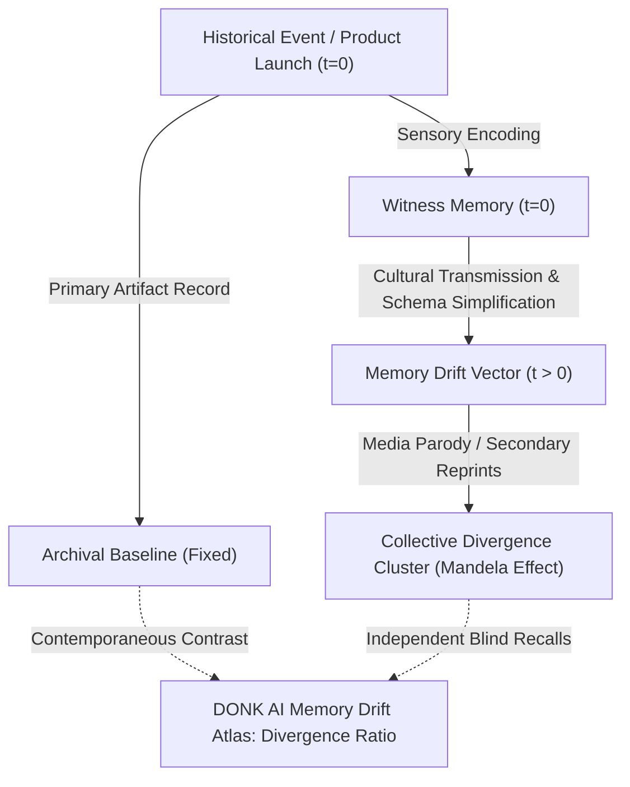

# The Epidemiology of Collective Memory: Mathematical Modeling of Memory Drift & The Mandela Effect

**Document Identifier:** `EPI-MEM-v1.0`  
**Status:** Protocol Research Foundation & Analytical Methodology  
**Scope:** Cultural Diffusion Models, Divergence Clustering, and Linguistic Shift Vectors.

---

## 1. Abstract

The Mandela Effect and shared recall divergence are frequently treated in sensationalist culture as pseudoscience or alternate realities. DONK AI approaches collective memory divergence through the rigorous lens of **cognitive epidemiology** and **cultural transmission dynamics**.

---

## 2. Memory Drift Diffusion Formulation

Let $M_i(t)$ represent the recall state of individual $i$ at time $t$. The rate of divergence from documented archival state $A_0$ is modeled as a function of cultural exposure rate $\beta$, schema simplification factor $\sigma$, and elapsed time $\Delta t$:

$$D(t) = 1 - e^{-\beta \cdot \sigma \cdot \Delta t}$$

When $D(t) \to 1$ across independent demographic clusters without direct peer communication, the protocol catalogs a **Systemic Cultural Schema Shift** on the Memory Drift Atlas.

---

## 3. The 5-Factor Convergence Rubric

Reviewers evaluate memory drift topics across five quantifiable metrics:
1. **Blind Overlap Density ($S_{\text{overlap}}$):** Percentage of unanchored witnesses agreeing on specific sensory markers.
2. **Geographic Distribution Entropy ($H_{\text{geo}}$):** Spread across non-adjacent municipal or national regions.
3. **Artifact Discrepancy Index ($I_{\text{diff}}$):** Measurable divergence between contemporaneous physical artifacts and popular recall.
4. **Media Reinforcement Factor ($R_{\text{media}}$):** Presence of secondary parodies, packaging redesigns, or broadcast errors that may have acted as cognitive vectors.
5. **Timeline Stability ($T_{\text{stab}}$):** Invariance of the recollection across generational cohorts.
