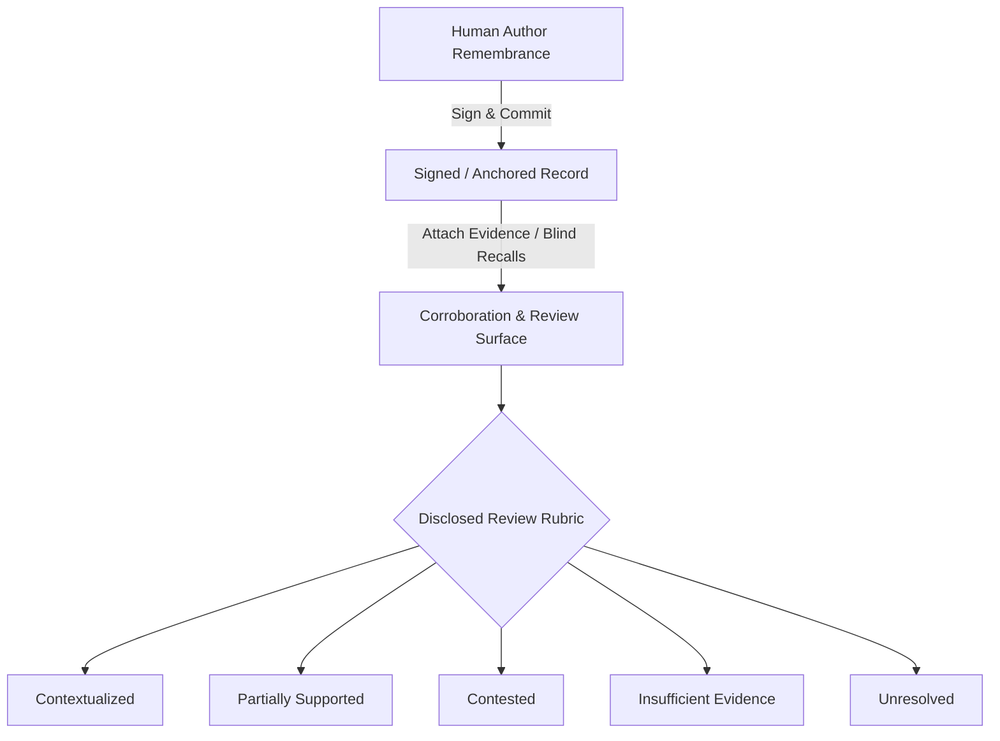

# Living Provenance Standard 1 (LPS-1 v2.0): Complete Technical Specification

**Document Identifier:** `LPS-1-SPEC-v2.0`  
**Protocol Specification Version:** `2.0.0`  
**Commitment Algorithm Version:** `lps1-merkle-v1`  
**Shared Fixture Revision:** `lps1-v1`  
**Governing Standard:** Antigravity Human Remembrance Protocol  

---

## 1. Canonicalization & Unicode Invariants

1. **Encoding:** UTF-8 throughout.
2. **Unicode Normalization:** All string values recursively undergo **Unicode Normalization Form C (`NFC`)**.
3. **Line-Ending Normalization:** All Carriage Return (`CRLF` / `\r\n` or `CR` / `\r`) sequences normalize to Line Feed (`LF` / `\n`).
4. **JSON Key Ordering:** Object keys are sorted recursively in ascending lexicographical order (ASCII byte comparison).
5. **Whitespace Handling:** Insignificant whitespace is stripped; values are rendered compactly with `:` separating keys/values and `,` separating entries.

---

## 2. Merkle Tree & Commitment Invariants

### 2.1 Cryptographic Constants
```text
EMPTY_EVIDENCE_ROOT  = 0x0000000000000000000000000000000000000000000000000000000000000000
EMPTY_LEAF_CONSTANT  = 0x0b96f989296d0d7f9adcbad65a1161244e359831749a8564280854ac27202d22
                      (Derivation: SHA-256("DONKAI:LPS1:EMPTY_MERKLE_LEAF:v1"))
```

### 2.2 Leaf Hashing (Domain-Separated)
For any object type $T \in \{\text{"REMEMBRANCE"}, \text{"EVIDENCE"}, \text{"REVIEW"}, \text{"CORROBORATION"}\}$:
$$\text{leafHash} = \text{SHA-256}(\text{"DONKAI:LPS1:LEAF:"} \parallel T \parallel \text{":v1:"} \parallel \text{canonicalUtf8Bytes})$$

### 2.3 Internal Node Hashing & Normative Byte Decoding
```text
LPS-1 Merkle parent preimage, version 1.0:
preimage = UTF8("DONKAI:LPS1:NODE:v1:") || decodeHex32(leftChild) || decodeHex32(rightChild)
parent   = SHA-256(preimage)
```

**Normative Rules:**
- `decodeHex32` strips an optional `0x` prefix and decodes exactly 64 hexadecimal characters into exactly 32 raw bytes.
- `leftChild` and `rightChild` are positional and **MUST NOT** be re-sorted after initial leaf ordering.
- The node prefix is UTF-8 encoded with no terminating NUL byte.
- Hash output **MUST** be serialized in manifests as lowercase `0x`-prefixed 64-hex strings.

### 2.4 Odd-Leaf Balancing Rule (Option B)
If layer $k$ has an odd number of nodes $2m + 1$, the final node $N_{2m}$ is paired positionally with `EMPTY_LEAF_CONSTANT`:
$$\text{parent}_{m} = \text{SHA-256}(\text{"DONKAI:LPS1:NODE:v1:"} \parallel \text{decodeHex32}(N_{2m}) \parallel \text{decodeHex32}(\text{EMPTY\_LEAF\_CONSTANT}))$$

### 2.5 Byte-Level Evidence Sorting
1. `evidence_id` is fixed 32 bytes.
2. `commitment` is fixed 32 bytes.
3. Compared as **unsigned big-endian byte arrays** in ascending order.
4. Duplicate `(evidence_id, commitment)` pairs are rejected with error.

---

## 3. Structured Intent & Replay Protection (EIP-712)

### 3.1 Domain Separator
```solidity
keccak256(
    abi.encode(
        keccak256("EIP712Domain(string name,string version,uint256 chainId,address verifyingContract)"),
        keccak256(bytes("DONK AI Human Remembrance Protocol")),
        keccak256(bytes("1")),
        chainId,
        verifyingContract
    )
);
```

### 3.2 CreateRemembrance Typehash
```solidity
bytes32 public constant CREATE_REMEMBRANCE_TYPEHASH = keccak256(
    "CreateRemembrance("
    "bytes32 recordId,"
    "bytes32 statementRoot,"
    "bytes32 evidenceRoot,"
    "bytes32 metadataRoot,"
    "bytes32 accessPolicyHash,"
    "bytes32 schemaHash,"
    "uint64 createdAt,"
    "uint64 deadline,"
    "uint256 authorNonce)"
);
```

---

## 4. Privacy & Authenticated Associated Data (AAD)

Private remembrance narratives are encrypted client-side using `AES-GCM-256`:
- **Key:** Derived client-side via PBKDF2 (100,000 rounds, SHA-256) or sovereign WebAuthn PRF.
- **IV:** Fresh, unpredictable 96-bit random IV per encryption operation.
- **AAD:** Explicitly bound to `recordId || schemaHash || recordVersion || accessPolicyHash`.
- **Integrity Rule:** Altered ciphertext, corrupted tag, mismatched AAD, or wrong key fails closed immediately before exposing plaintext.

---

## 5. Epistemic Assessment Rubric & Proof Taxonomy

### 5.1 Branching Assessment Flow


### 5.2 Multi-Identity Proof Pathways

| Record Proof Path | Precise Cryptographic Claim | What It Does NOT Claim |
| :--- | :--- | :--- |
| **EVM Wallet Signature** | A specific EVM account signed the EIP-712 typed-data digest. | Does not verify physical human identity or historical truth. |
| **Passkey / WebAuthn Authorization** | A biometric WebAuthn credential authorized an action via smart account / session validator. | Not directly an EIP-712 signature unless verified through ERC-4337/ERC-1271. |
| **Local Sovereign `did:key`** | An ephemeral or persistent DID keypair signed the portable manifest off-chain. | Does not imply an on-chain transaction or global ledger consensus. |
| **ERC-1271 Contract Wallet** | A deployed smart-account contract validated the signature under its own validation rules. | Does not guarantee the smart account's governance rules. |
