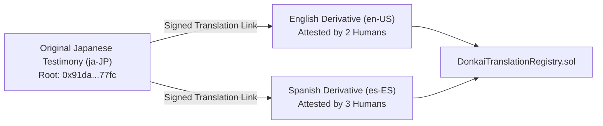

# DONK AI: Multilingual Translation & Attestation Standard

**Document Identifier:** `TRANS-SPEC-v1.0`  
**Status:** Shipped Specification  
**Reference Crate:** `crates/donkai-translation` & `contracts/src/DonkaiTranslationRegistry.sol`

---

## 1. The Principle of Original-Language Primacy

In DONK AI, original human testimony is **canonical**. Translations are signed, immutable **derivative records**, never silent replacements or destructive edits.



---

## 2. Derivative Translation Bundle Schema (`donkai.translation.v1`)

```json
{
  "type": "donkai.translation.v1",
  "originalStatementRoot": "0x91da77fc01928374a5b6c7d8e9f0123456789abcdef0123456789abcdef01234",
  "targetLanguage": "en-US",
  "translatedNarrative": "I remember the prototype modular synthesizer demo in Shinjuku...",
  "translatorIdentity": "0x7391...F82c",
  "humanAttestation": "I attest that this translation faithfully preserves the dialect and tone of the original testimony.",
  "aiAssistanceNotes": "Draft assistance via LLM; fully post-edited and verified by bilingual human translator.",
  "timestamp": "2026-08-29T06:36:00Z"
}
```

---

## 3. Human Attestation Quorum

A translation achieves "Verified Derivative" status on the Memory Drift Atlas when at least **two independent human translators** with valid `DonkaiHumanPass.sol` credentials cryptographically attest to its semantic accuracy.
