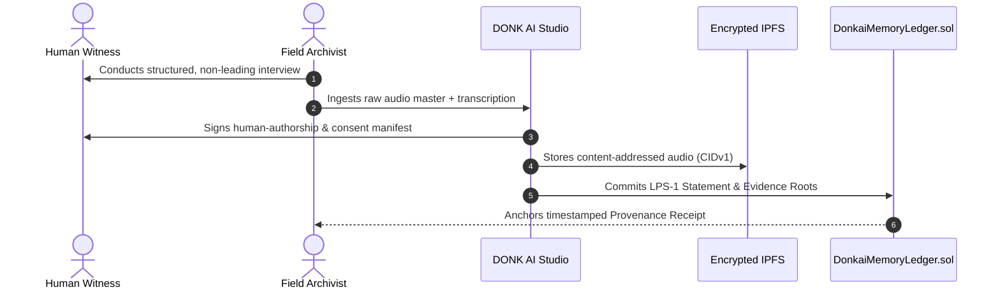

# DONK AI: Oral History & Field Archival Playbook

**Document Identifier:** `ORAL-ARCH-v1.0`  
**Status:** Best Practice Standard for Community Archivists and Field Researchers

---

## 1. Field Recording Standards

When collecting first-person oral remembrances for LPS-1 anchoring:
1. **Audio Format:** Uncompressed 24-bit / 96kHz PCM WAV master recording.
2. **Environmental Baseline:** 30 seconds of ambient room tone recorded prior to interview commencement.
3. **Hardware Provenance:** Capture microphone make/model, serial number, and recorder timestamp in `ContextManifest`.

---

## 2. Ingestion & Provenance Workflow

---

## 3. Retraction & Empathy Protocol

Archivists must inform witnesses of their permanent right to retract or restrict their oral testimony. If requested, a tombstone event is signed, and media payloads are unpinned immediately.
