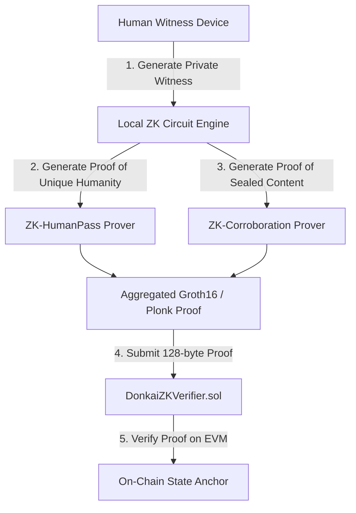

# DONK AI: Zero-Knowledge Provenance & Privacy Roadmap

**Document Identifier:** `ZK-PROV-ROADMAP-v1.0`  
**Status:** Planned Architecture & Research Prototype  
**Scope:** Privacy-Preserving Blind Corroboration, Anonymous Human Pass Verification, and Verifiable Sealed Roots.

---

## 1. Executive Summary

As DONK AI scales globally, privacy requirements will expand beyond symmetric client-side encryption to include **zero-knowledge succinct non-interactive arguments of knowledge (zk-SNARKs)**. This roadmap outlines the cryptographic architecture for enabling witnesses to prove that they possess authentic recollection details and human credentials without revealing their identity, location, or unsealed testimony to any centralized validator or observer.

---

## 2. Key ZK Primitives

### 2.1 ZK-Blind Corroboration (`Circom / Noir`)
Witnesses prove that their narrative contains specific semantic anchor hashes without exposing the plaintext text string:
$$\pi_{\text{corrob}} = \text{ZK-Prove}\Big(\{ \text{narrative}, \text{salt} \}, \{ \text{sealedRoot}, \text{discoveryHash}, \text{timestamp} \}\Big)$$

### 2.2 ZK-Human Pass
Enables anonymous sybil resistance. A witness proves they hold a valid Soulbound Human Pass issued by a designated steward, without revealing their public Ethereum address:
$$\pi_{\text{human}} = \text{ZK-Prove}\Big(\{ \text{privateKey}, \text{passSignature} \}, \{ \text{merkleRootOfPasses}, \text{nullifierHash} \}\Big)$$

---

## 3. Implementation Milestones

| Milestone | Target Horizon | Deliverables |
| :--- | :--- | :--- |
| **Phase 1: Research Prototype** | Q4 2026 | Noir circuits for Poseidon leaf commitments and salt verification. |
| **Phase 2: Verifier Contracts** | Q1 2027 | EVM on-chain pairing verifier (`DonkaiZKVerifier.sol`). |
| **Phase 3: Browser Proving** | Q2 2027 | WebAssembly proving engine integrated into `web/corroborate.html`. |
